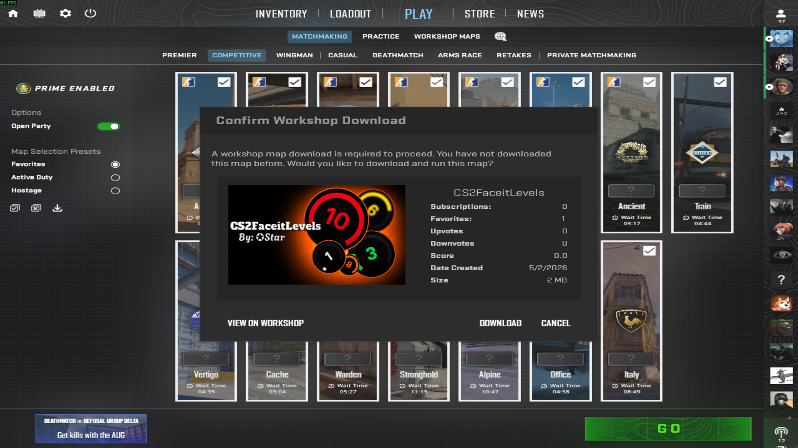
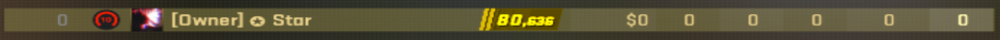

# CS2FaceitLevels

CS2 plugin that shows a player's real FACEIT level in the CS2 scoreboard.

The plugin does this:

1. Reads the player's SteamID64 after authorization.
2. Requests the player's FACEIT CS2 skill level from the FACEIT Data API.
3. Writes the mapped pin ID to the scoreboard pin slot.
4. workshop addon replaces those pin images with FACEIT level images.
- 

-


## Requirements

- [CounterStrikeSharp](https://github.com/roflmuffin/CounterStrikeSharp)
- [MultiAddonManager](https://github.com/Source2ZE/MultiAddonManager)
- [Faceit API Key](https://developers.faceit.com/apps)
- [this workshop addon](https://steamcommunity.com/sharedfiles/filedetails/?id=3718321446) [addon ID: 3718321446]

## Install on server

Copy the `addons` folder into your CS2 server `game/csgo/` folder:

Edit this file and add your FACEIT API key:

```text
counterstrikesharp/configs/plugins/CS2FaceitLevels/CS2FaceitLevels.json.
```

## MultiAddonManager Setup

- you will need this addon ID [3718321446] if you want the plugin to work
- MultiAddonManager config path: game\csgo\cfg\multiaddonmanager

```
mm_extra_addons 				"3718321446"
mm_client_extra_addons			"3718321446"
```

- if you want to add multiple addons in MultiAddonManager
```
mm_extra_addons 				"3718321446,3472082269"
mm_client_extra_addons			"3718321446,3472082269"
```
## notice
- about the workshop map you do not need to Subscribe manually MultiAddonManager will do everything for you
- i just release it so i am waiting for steam to approve it
- for better experience i highly recommended Disabling any plugin that change coins/pins. 
- CS2FaceitLevels plugin will override them but it will take 15sec to reapply FaceitLevles :)
